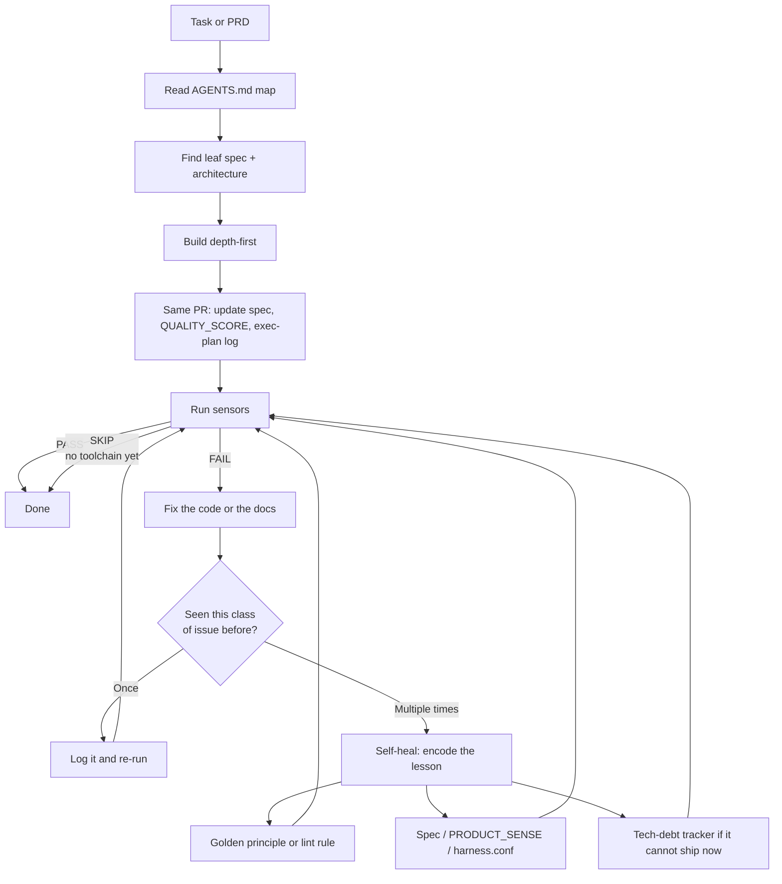

# bootstrap-agentic-harness

Cursor skill that turns a PRD, tech doc, or one-paragraph vision into an **agent-first repo**: a short `AGENTS.md` map, product specs, living exec plans, quality sensors, git hooks, and CI.

The agent does not dump files and leave. It fills the harness from your PRD, runs sensors, and writes every repeatable failure back into docs, lint, or the tech-debt tracker so the next run is smarter.

[Detailed guide](./README.detailed.md) · [SKILL.md](./SKILL.md) · [reference.md](./reference.md)

---

## How the agent works



**Sensors** are mechanical checks (`doc-links`, `index-sync`, secrets, copy, stack lint/test). They print `SENSOR id PASS|FAIL|SKIP` plus a `REMEDIATION` line the agent can grep.

**Doc updates travel with the code.** A behavior change that does not touch its leaf spec or quality grade is a harness failure — same class of bug as a red test.

**Self-healing** is not the model fine-tuning itself. A one-off bug gets a fix. The same bug twice becomes a rule, a sensor pattern, or a spec bullet. After that the *harness* fails next time — no chat memory required.

**Tech-debt tracker** (`docs/exec-plans/tech-debt-tracker.md`) is the parking lot for gaps that are real but not this PR: known holes, deferred sensors, “fix after the MVP.” Items move to Resolved with a date; they do not live only in Slack.

---

## Usage

Install this folder as a Cursor skill:

```bash
mkdir -p ~/.cursor/skills
ln -sfn ~/Projects/agent-skills/bootstrap-agentic-harness \
        ~/.cursor/skills/bootstrap-agentic-harness
```

Attach `/bootstrap-agentic-harness` (or mention it) and point at a **product** repo:

```
Use bootstrap-agentic-harness on ~/Projects/acme-billing.

PRD: web app for freelance accountants — invoices + Stripe.
TypeScript, Next.js, Postgres.

MVP in: auth, invoice CRUD, Checkout, PDF.
MVP out: payroll, mobile.
```

The agent will:

1. Extract intake (name, stack, domains, MVP in/out).
2. Scaffold with `scripts/bootstrap.sh`.
3. Fill every `{{TOKEN}}` and `<!-- FILL -->` from the PRD.
4. Wire sensors, hooks, CI, and the first exec plan.
5. Run `verify-harness.sh` until green.

After that, **do not re-run this skill on every feature.** Work inside the harness: find the spec, build, update docs in the same PR, run sensors. Re-invoke only to harness a new repo, add a skipped module, or repair a deleted payload.

Phases, target folder tree, optional modules, and the failure→rule tables: [detailed README](./README.detailed.md).
